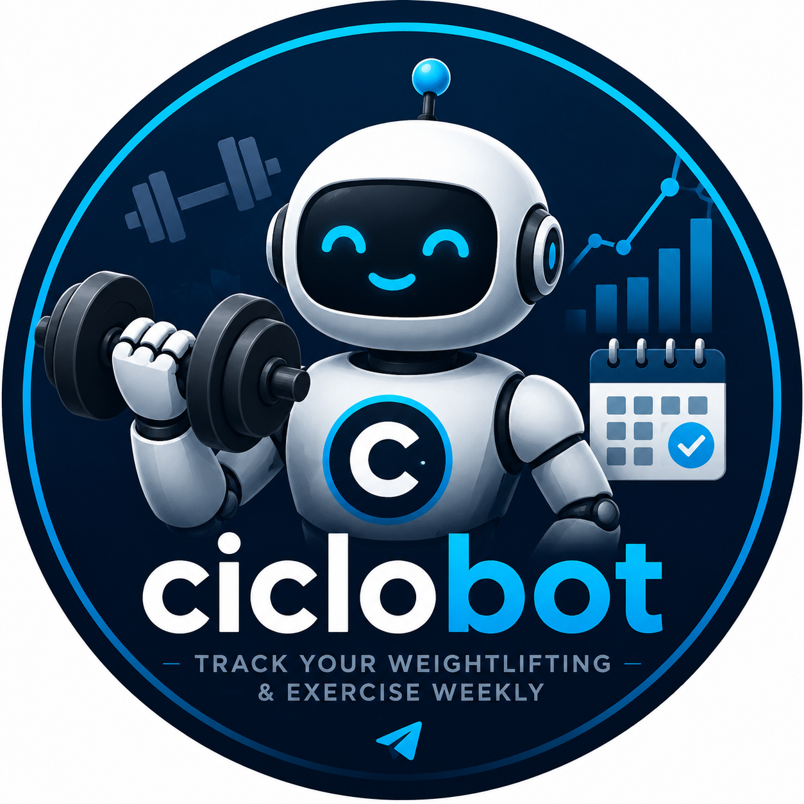

# ciclobot



Telegram bot that tracks a small group's weekly 5×5 weightlifting numbers in a Google Sheet, and nudges anyone who hasn't logged by Sunday evening.

## What it does

- **Lifts tracked.** `bench`, `squat`, `deadlift` are *required* (you'll be reminded). `clean_and_jerk`, `snatch` are *optional* (logged opportunistically, never reminded).
- **Each entry** = working weight in kg + whether you completed all 5 sets.
- **Body weight** logged once per week (kg).
- **Reminder** posted Sunday at 19:00 Europe/Madrid, tagging only people missing required entries.
- **Storage** is a single Google Sheet with three tabs (`participants`, `log`, `bodyweight`). Everyone in the group can view the sheet directly.

Commands: `/help` shows the full list inside the bot.

## Manual setup — one-time, ~15 minutes

You will need:
- A Telegram account.
- A Google account (free).
- A [Railway](https://railway.app) account (free tier is enough).

### 1. Create the Telegram bot

1. Open Telegram and message [@BotFather](https://t.me/BotFather).
2. Send `/newbot`. Pick a display name (e.g. "Ciclobot") and a username ending in `bot` (e.g. `myciclobot_bot`).
3. Copy the **HTTP API token** BotFather replies with. You'll use this as `BOT_TOKEN`.
4. *(Optional, recommended.)* In BotFather, send `/setprivacy` → pick your bot → choose **Enable**. This is the default for new bots, so it's already on — but verifying takes 5 seconds and avoids a known caching quirk where adding a bot to a group before this is set can leave it in the wrong state. "Privacy Enabled" means the bot only sees slash commands, replies, and @-mentions — never ordinary group chatter. That's what you want.
5. Add the bot to your Telegram group. It does **not** need to be an admin. If the bot was already in the group when you toggled privacy in step 4, remove it and re-add it so the change takes effect.

### 2. Find the group's chat ID

You need the numeric chat ID (negative for groups). Quickest way:

1. Send any message in the group.
2. Open `https://api.telegram.org/bot<BOT_TOKEN>/getUpdates` in a browser (replace `<BOT_TOKEN>`).
3. Find `"chat":{"id":-100…}` in the JSON. That negative number is your `CHAT_ID`.

If the JSON is empty, the bot hasn't seen any updates yet — try sending another message in the group, then refresh.

### 3. Create the Google Sheet

1. Go to [Google Sheets](https://sheets.new) and create a new spreadsheet. Name it whatever you like (e.g. "ciclobot data").
2. Note the **spreadsheet ID** from the URL: `https://docs.google.com/spreadsheets/d/<THIS_IS_THE_ID>/edit`. You'll use this as `SHEET_ID`.
3. The bot will create the three tabs (`participants`, `log`, `bodyweight`) and write headers automatically on first run. You can leave the default empty sheet as-is.

### 4. Create the Google service account

1. Go to the [Google Cloud Console](https://console.cloud.google.com/).
2. Create a new project (top bar → project picker → "New project"). Name it e.g. "ciclobot".
3. In the search bar, search for **"Google Sheets API"**, open it, and click **Enable**.
4. In the left nav: **IAM & Admin → Service Accounts → Create service account**.
   - Name: `ciclobot-sheets`.
   - Skip the optional permissions step (no IAM role needed — we share the sheet directly).
   - Click **Done**.
5. Click the new service account → **Keys** tab → **Add key → Create new key → JSON**. A `.json` file downloads. This is your `GOOGLE_SERVICE_ACCOUNT_JSON`.
6. Open the JSON file and copy the `client_email` value (looks like `ciclobot-sheets@<project>.iam.gserviceaccount.com`).
7. Back in your Google Sheet: click **Share**, paste that email, set permission to **Editor**, untick "Notify people", click **Share**.

### 5. Deploy to Railway

The bot uses long polling — no public HTTP port, no domain, no webhook setup.

1. Push this repo to GitHub.
2. In Railway, create (or open) a project, then **+ Create → GitHub Repo** and pick this repo. The `railway.toml` at the repo root configures the Dockerfile path, builder, and restart policy automatically — no manual dashboard settings needed.
3. **Variables** tab → add:
   - `BOT_TOKEN` = the BotFather token from step 1.
   - `SHEET_ID` = the spreadsheet ID from step 3.
   - `CHAT_ID` = the negative chat ID from step 2.
   - `TZ` = `Europe/Madrid` (or your timezone).
   - `GOOGLE_SERVICE_ACCOUNT_JSON` = paste the **entire contents** of the JSON file from step 4 as one variable value. Railway accepts multiline values.
4. Deploy. The first log line should be `ciclobot starting — chat <CHAT_ID>, tz Europe/Madrid`.

### 6. Verify

In your Telegram group:

```
/help        — should print the full instructions
/join        — bot asks for your height (cm), then body weight (kg)
/log bench 100 yes
/week        — shows the current week's table
```

Open your Google Sheet — you should see the three tabs populated.

## Local development

```
pnpm install
cp .env.example .env   # at repo root; fill in BOT_TOKEN, SHEET_ID, etc.
pnpm -F ciclobot dev
```

`pnpm -F ciclobot dev` uses `tsx watch`, so changes reload automatically.

To run the typecheck and linter:

```
pnpm -F ciclobot typecheck
pnpm -F ciclobot lint
```

## Architecture notes

- **TypeScript strict mode + zod everywhere.** Every external input (env, Telegram updates, Google Sheets rows) is parsed through a zod schema; TS types are `z.infer<typeof Schema>`. There are no `as` casts, no `!` non-null assertions, and no `any`.
- **Join key is `user_id`.** Telegram's numeric user ID is immutable and used as the foreign key for every row. `username` is denormalized for display.
- **Sheet writes are upserts on a composite key.** `(iso_week, user_id, lift)` for lifts and `(iso_week, user_id)` for bodyweight — re-logging in the same week overwrites.
- **The bot is locked to a single group** via `CHAT_ID`. Updates from DMs or other groups are dropped by the `onlyChat` middleware.

## Troubleshooting

- *"Invalid environment configuration"* on startup → one of the env vars is missing/malformed. The error names which one.
- *Bot doesn't respond in the group* → check `CHAT_ID` matches the actual group. The middleware silently drops other chats. Also confirm BotFather privacy mode is **Enable** (default) — commands still reach the bot.
- *"Tab not found" or sheet errors* → the service account email is missing Editor access on the sheet. Re-share with the right email.
- *Reminder fires at the wrong time* → check `TZ` env var. The cron uses that timezone.
