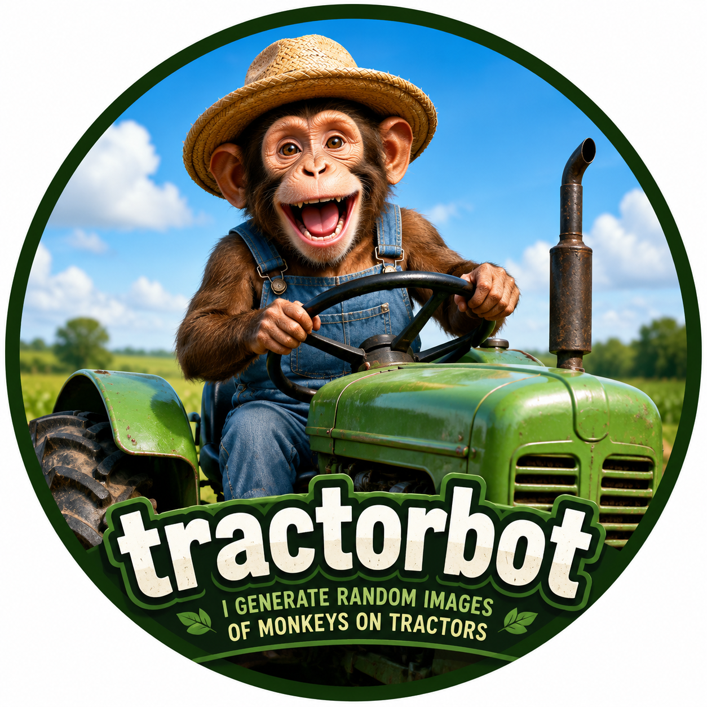

# tractorbot



Telegram bot that listens to a group chat and, whenever someone says the word **claude** or **claudio**, replies with a freshly Gemini-generated image of a monkey driving a tractor. Each prompt randomizes style, tractor, setting, and quirks for entropy.

## What it does

- **Listens to every text message** in one configured group.
- **Trigger words** (default `claude,claudio`, case-insensitive, whole-word match) fire a generation.
- **Each generation** picks random parts (style/tractor/setting/quirk/mood/pose/camera-angle/time-of-day/lighting) and asks `gemini-2.5-flash-image` for an image.
- **Whatever else you wrote alongside the trigger word becomes part of the prompt** — `claude un buen john deere` steers the image toward a John Deere; `claude pirate ship` makes the tractor a pirate ship. Empty messages (just `claude`) generate fully at random.
- **Reply** with the photo, captioned with the style and (if you gave one) your hint.
- **Cooldown** (default 60 s) keeps spam contained when the chat is hot.

## Telegram privacy setting — read this

For tractorbot to read ordinary group chatter (not just commands), BotFather privacy must be **OFF**:

1. Message [@BotFather](https://t.me/BotFather) → `/setprivacy` → pick this bot → **Disable**.
2. If the bot was already in the group, remove and re-add it so the change takes effect.

(This is the opposite of ciclobot, which keeps privacy ON.)

## Setup

You need:

- A Telegram bot token (BotFather → `/newbot`).
- A Gemini API key from [Google AI Studio](https://aistudio.google.com/apikey).
- The numeric `CHAT_ID` of the target group (same trick as ciclobot's README — open `https://api.telegram.org/bot<TOKEN>/getUpdates`).

### Env vars

| Name | Required | Default | Notes |
| --- | --- | --- | --- |
| `BOT_TOKEN` | yes | — | BotFather token. |
| `GEMINI_API_KEY` | yes | — | AI Studio key. |
| `CHAT_ID` | yes | — | Negative numeric ID of the target group. |
| `TRIGGER_WORDS` | no | `claude,claudio` | Comma-separated, case-insensitive, whole-word. |
| `COOLDOWN_SECONDS` | no | `60` | Minimum seconds between successful generations. |
| `GEMINI_MODEL` | no | `gemini-2.5-flash-image` | Override only if Google renames the model. |

## Deploy

Add tractorbot as a **second service inside the same Railway project as ciclobot** (so logs and billing stay together). One-time setup in the new service's **Settings**:

1. **Source** → the same GitHub repo.
2. **Config-as-Code** → set the config file path to `/apps/tractorbot/railway.toml`. That file pins the Dockerfile path, the restart policy, and zero-overlap deploys (Telegram allows only one consumer of `getUpdates` per token).

Railway does **not** support a single root `railway.toml` covering multiple services — each service needs its own Config-as-Code path pointing at its own file under `apps/<bot>/railway.toml`.

## Local dev

```
pnpm install
pnpm -F tractorbot dev
```

Tractorbot will fail fast if any required env var is missing.

## Architecture notes

- Same strict-TS + zod conventions as ciclobot. No `as`, no `!`, no `any`.
- No persistence — tractorbot has no Google Sheet, no domain state. Just listen → match → generate → reply.
- The Gemini client is a thin REST wrapper. Response is zod-parsed before reading inline image bytes.
